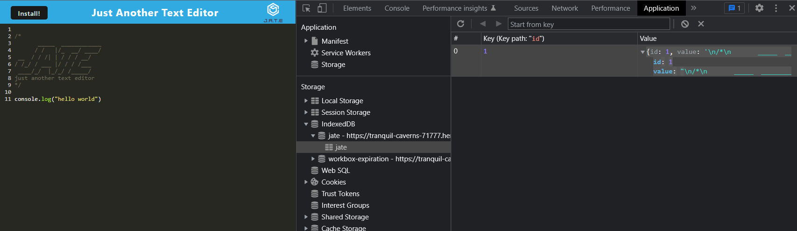

# Text-Editor-PWA
By: thandyn

Email: nguyenphuthan@gmail.com

## Description
This project demonstrates using PWA to develope a code to make a text editor with javascript syntax highlight.  

## Table of Content 
  - [Installation](#installation)
  - [Usage](#usage)
  - [Questions](#questions)
  - [License](#license)
  - [Contribute](#contribute)
  - [Test](#test)
  - [Links](#links)

## Installation
The steps to install packages is to open terminal and typing in `npm install` in the root directory to install the packages to client and server folder. 

## Usage

This is text editor. User can type in javascript syntax and install the app to their computer. Data will be stored into the  browers database and whatever user types will be saved and stay for the next session

The following image shows the application `manifest.json` file. The file was generated with the WebpackPwaManifest package.

The following image shows the application's registered service worker. We had to code to implement asset caching.

This image shows the application indexedDB storage. We had to add 2 routes in the `database.js` to PUT and GET database.

When users click on install, a prompt will pop up and ask user if they wish to install on their local machine. The button will not work if user already have the web application installed on their computer.

This is the code for the route. 

This code allows the button to work and have the application installed on the user's local machine.

## License
MIT

## Contribute
If you wish to contribute to this project, please email me.

## Test
To test this project, run `npm run start` from the root directory. Go onto the browswer and go to local host with port 3000. 

## Questions
If you have any questions, please email me at: nguyenphuthan@gmail.com. 

For more information, please visit my Github link: https://github.com/thandyn/.

## Links 
Github repo: https://github.com/thandyn/Text-Editor-PWA

Deployed website: https://tranquil-caverns-71777.herokuapp.com/
